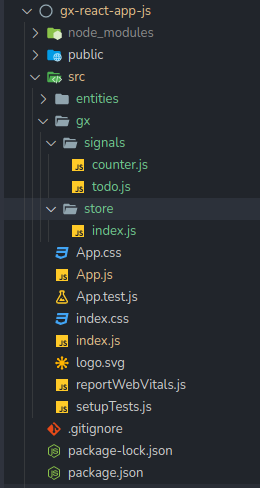

# GX - Global State Management for React Applications


This library aims to provide you an `easy` and `fast` way to set up and manage the global state of your **`react`** application.

## Installation

You can use `npm` or `yarn` to install this library into your react application.

### Using npm

```bash
npm install gx
```

### Using yarn

```bash
yarn add gx
```

## Prerequisites

This library doesn't work properly in strict mode. So to avoid some issues, please disable strict mode in your react application first before using it.

## Definition of concepts

**GX** comes with some new concepts like `signal`, `action` and `store`.

### Signal

**Signal** represent a specific state that your application has to manage.
For example, for managing users and products inside your ecommerce application you will have to create two separate signals called `usersSignal` and `productsSignal`.

For handle it, there is a special `createSignal` function for this case.

### Action

**Actions** represent functions that act to the state and make it changing over the time. 

Your have to specify these `actions` when you create yours `signals`.

### Store

**Store** is a collection of `signals`. We know that in an application, we can manage many state separately, so `gx` gives you the possibility to centralize all your state into a special place. The state becomes easier to manage like that.

For handle it, there is a special `createStore` function for this case, which takes an array of `signals`.

## Usage

### First step: Setting up the code structure.

For structuring your code very well you have to follow these steps.

- Create a directory called `gx` or whatever you want inside the `src` directory
- Inside the `gx` directory, create two others one called `signals` and `store`.
- Inside the signals directory you will create files that will contains your state declaration with actions that act to this state. (`eg`: **counter.js** for exemple)
- Inside the store directory, just create an index.js file. We will see how to fill it.


Here is the result.



